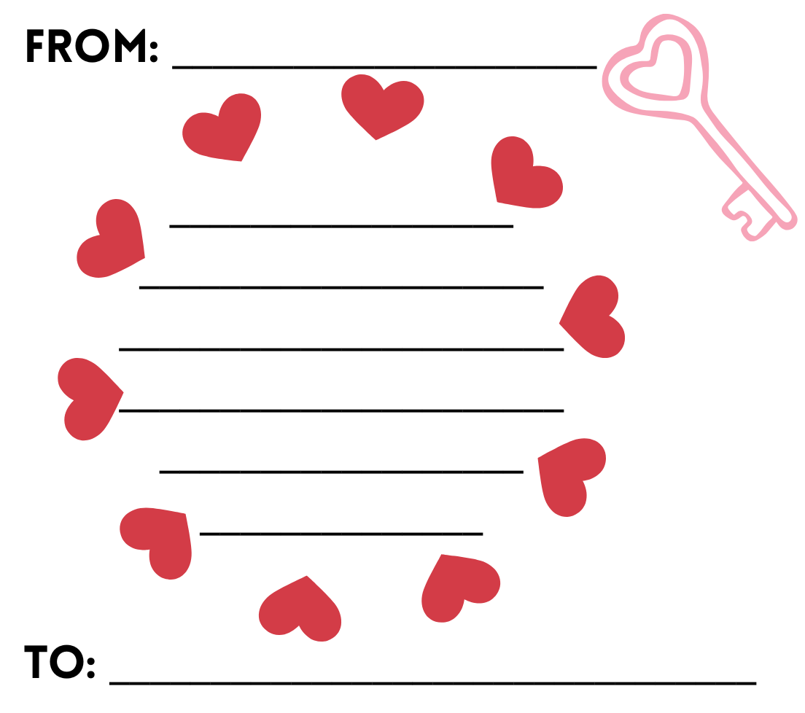

# 💌 Digital Candy Grams App

A Next.js application designed for university Resident Assistants (RAs) or student organizations to host digital Valentine's Day events. Students can draw custom messages on a digital "Candy Gram," select a destination dorm building, and submit them. This was created specifically for Bradley University's Residential Living department by the "Enthusiasm" initiative.

Admins can access a dashboard to view all submissions, filter by building, and **export them as print-ready PDFs** (formatted 6-per-page) to attach to candy and deliver.
The dashboard is hosted on `/admin` and is secured with a password.



## ✨ Features

- **Digital Drawing Canvas**: 
  - Color palette with eraser support.
  - Users draw directly over a customizable background template.
  - Prevents blank submissions.
- **Routing System**: Students select a destination building (e.g., Williams, Harper, Geisert) for easier sorting.
- **Admin Dashboard** (Password Protected):
  - View all submissions with visual thumbnails.
  - Filter submissions by building.
  - Delete inappropriate or test entries.
- **PDF Generation**:
  - Automatically formats cards into a printable US Letter PDF.
  - Fits 6 cards per page (2 columns x 3 rows). Handles optimization for different card amounts as well (IE 7 cards print across 2 pages to optimize layout).
  - Perfect for printing, cutting, and distributing.

## 🛠 Tech Stack

- **Framework**: [Next.js 14+](https://nextjs.org/) (App Router)
- **Database**: PostgreSQL (via Supabase or Vercel Postgres)
- **ORM**: [Prisma](https://www.prisma.io/)
- **Styling**: Tailwind CSS
- **PDF Generation**: `@react-pdf/renderer`
- **Canvas**: `react-sketch-canvas`

## 🚀 Installation & Setup

### 1. Prerequisites
- Node.js (v18 or higher)
- A PostgreSQL database URL (can be local or hosted on Vercel/Supabase).

### 2. Clone the Repository
```bash
git clone [https://github.com/Conmmander/CandyGramApp.git](https://github.com/Conmmander/CandyGramApp.git)
cd CandyGramApp
npm install
```

## Creation
This app was made using Google Gemini Pro, a large language model. While it is a trivial web application, it was also the first project that the creator "Vibe Coded", and
was meant to see if such methods could actually generate usable code.
